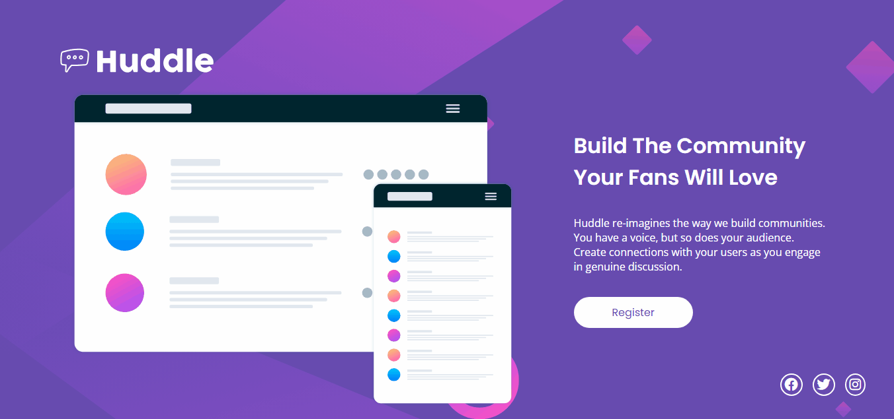
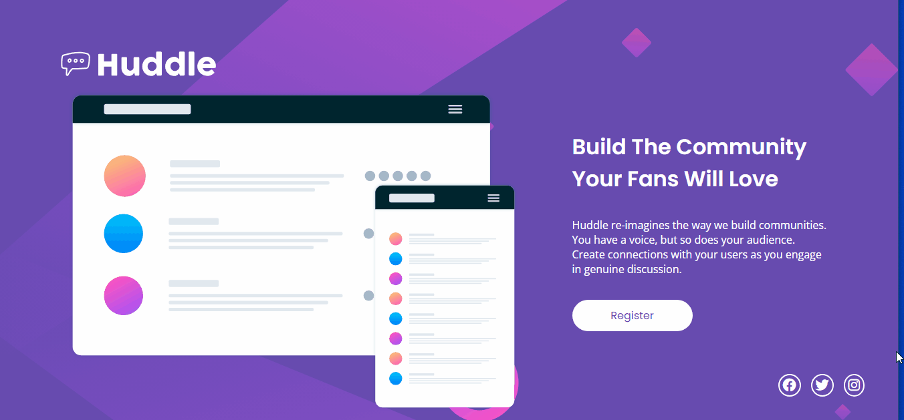

# Informações do Projeto

Projeto proposto pelo curso DevQuest. Com Html e CSS do básico ao avançado. O projeto consiste em uma página simples com cabeçalho, conteúdo princial, e rodapé com link para as redes sociais.

# Considerações Finais

Fiquei muito feliz de conseguir concluir minha primeira Quest do curso DevQuest. Em vários momentos fiquei travado em algumas partes da página porém depois de alguns dias consegui conlcuir todo o projeto. Estou bastante empolgado em seguir o curso e fazer as proximas Quests! 

## Tecnologias Utilizadas

- Html
- CSS

## Resultado Final do Projeto

